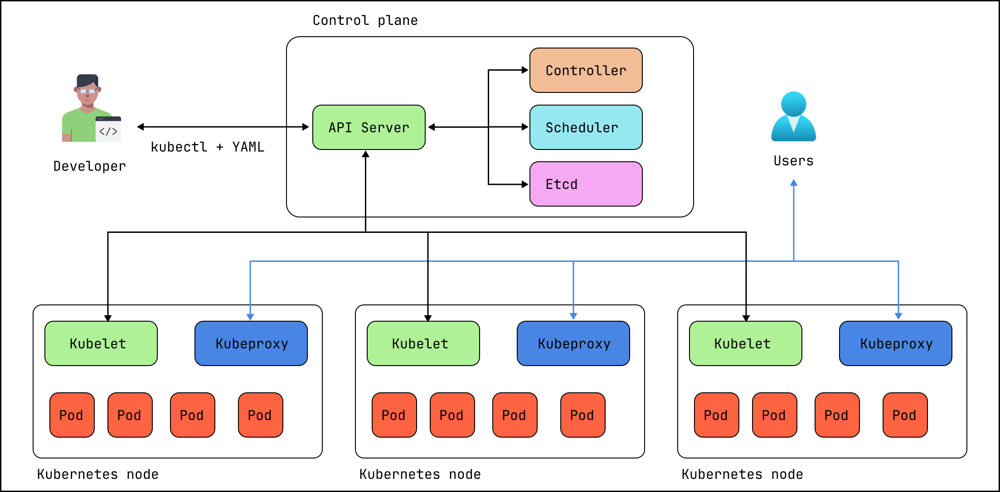

# Azure Kubernetes Service (AKS) terraform module

Azure Kubernetes Service (AKS) terraform module.
To get Azure Kubernetes latest version per region use:

- `az aks get-versions --location northeurope --output table`

## Usage

```hcl
module "aks" {
  source                      = "github.com/kolosovpetro/AzureAKSTerraform.git//modules/aks?ref=master"
  aks_name                    = "aks-${var.prefix}"
  default_node_pool_type      = "VirtualMachineScaleSets"
  default_node_pool_vm_size   = "Standard_D4s_v3" # or Standard_DS2_v2
  kubernetes_version          = "1.34.01"
  resource_group_location     = azurerm_resource_group.public.location
  resource_group_name         = azurerm_resource_group.public.name
  system_node_count           = 3
  should_deploy_log_analytics = false
}
```

## Required Azure providers

- Microsoft.Monitor
    - `az provider register --namespace Microsoft.Monitor`
    - `az provider show --namespace Microsoft.Monitor --query "registrationState"`
- Microsoft.Dashboard
    - `az provider register --namespace Microsoft.Dashboard`
    - `az provider show --namespace Microsoft.Dashboard --query "registrationState"`

## Terraform Modules implemented

- ACR -- creates new ACR and assigns `acrPull` role to AKS
- ACR association -- assigns AKS `acrPull` role to existing ACR
- AKS
- Log analytics
- Managed Prometheus
- Managed Grafana (requires `Microsoft.Dashboard`)

## Terraform providers used

- https://registry.terraform.io/providers/Azure/azapi/latest/docs

## K8s Architecture



